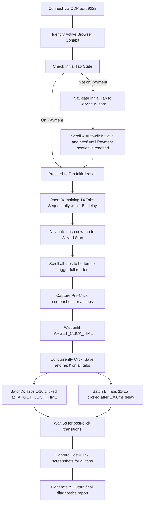

# 🤖 Playwright CDP Automation Project (CIMEA Portal)

This project contains a high-performance, concurrent multi-tab Playwright automation suite designed to submit time-sensitive forms on the **CIMEA Portal** (`https://mywallet.cimea-diplome.it/`). It leverages **Chrome DevTools Protocol (CDP)** connections to attach to an active browser instance, enabling Turnstile Captcha bypass, headed login initialization, and headless scheduled background execution.

---

## ⚡ Quick Start: Headless Automation Flow

Below is the complete step-by-step guide to running your automation scripts completely in the background without login timeouts.

### 1. Initial Login & Session Authorization (Headed Mode)
Run this command to open a physical Google Chrome window using a dedicated user data profile:
```bash
google-chrome --remote-debugging-port=9222 --user-data-dir="$HOME/.chrome-dev-profile"
```
* **Action:** Go to `https://mywallet.cimea-diplome.it/#/auth/login`, complete the login procedure, solve the Cloudflare Turnstile captcha, input your 2-Factor Authentication (2FA) code, and navigate until you land on the main account dashboard.

### 2. Start Chrome in Headless Mode (Background)
Close the Chrome window from the previous step, and launch the browser headlessly in the background while keeping the debugging port open:
```bash
google-chrome --headless=new --remote-debugging-port=9222 --user-data-dir="$HOME/.chrome-dev-profile" &
```

### 3. Start the Keep-Alive Worker
Launch the session keep-alive service to periodically reload the dashboard and extend the active session (prevents the 1-hour idle logout):
```bash
npm run run:keepalive
```

### 4. Execute Your Scheduled Automation
Execute the main automation script. It attaches to the headless session, opens the tabs, and executes scheduled clicks:
```bash
npm run run:cdp
```

---

## 🔄 Under-The-Hood Execution Flow

The system coordinates the main CDP automation (`tests/cdp-automation.ts`) through the following structured lifecycle steps:



1. **CDP Port Connection**: Connects to the browser instance on port `9222`.
2. **Initial Tab Synchronization**: Analyzes the first tab's URL. If it isn't at the final "Payment" stage of the wizard, it automatically scrolls and clicks "Save and next" repeatedly to guide the tab to the payment confirmation screen.
3. **Sequential Multi-Tab Opening**: Opens a configurable amount of tabs (Default: `15`) with a sequential delay (`1500ms`) to avoid overloading browser memory, and directs each to the new service URL.
4. **Pre-Click Captures & Scroll**: Scroll elements on all tabs to verify full UI rendering and take diagnostic screenshots of each tab prior to the scheduled click.
5. **Scheduled Batch Execution**: 
   * **Batch A (Tabs 1–10)**: Scheduled to click the finalize button concurrently at `TARGET_CLICK_TIME`.
   * **Batch B (Tabs 11–15)**: Scheduled to click with a `1000ms` offset gap.
6. **Diagnostics Extraction**: Runs evaluated DOM parsing code on the page (safely wrapped in IIFEs to bypass `esbuild` name mangling) to capture application states, active stepper pills, warnings, error banners, and remaining session time.

---

## 📂 Project Structure

* 📂 **`tests/`**
  * 📄 **[`cdp-automation.ts`](file:///mnt/A0743AA8743A8158/projects/Automation_Script/tests/cdp-automation.ts)**: The primary automation coordinator running concurrent scheduled clicks and state diagnostics.
  * 📄 **[`keep-alive.ts`](file:///mnt/A0743AA8743A8158/projects/Automation_Script/tests/keep-alive.ts)**: The background worker that keeps the authorized session alive.
  * 📄 **[`save-session.ts`](file:///mnt/A0743AA8743A8158/projects/Automation_Script/tests/save-session.ts)**: Saves cookies and session data to local JSON storage for backup.
  * 📄 **[`login.spec.ts`](file:///mnt/A0743AA8743A8158/projects/Automation_Script/tests/login.spec.ts)**: Helper script that simplifies credentials entry and uses custom human-like mouse simulation to help resolve Turnstile checkboxes.
* 📄 **[`.env`](file:///mnt/A0743AA8743A8158/projects/Automation_Script/.env)**: Secure configuration holding credential variables (`EMAIL`, `PASSWORD`).
* 📄 **[`playwright.config.ts`](file:///mnt/A0743AA8743A8158/projects/Automation_Script/playwright.config.ts)**: Main Playwright configuration for browser settings.
* 📄 **[`steps.md`](file:///mnt/A0743AA8743A8158/projects/Automation_Script/steps.md)**: Reference guide with quick start command shortcuts.

---

## 🛠️ Available Scripts

| Command | Action |
| :--- | :--- |
| `npm run run:cdp` | Executes the main multi-tab CDP automation flow. |
| `npm run run:keepalive` | Begins the 15-minute dashboard refresh routine. |
| `npm run save:session` | Connects via CDP to save the currently open session storage. |
| `npm run login` | Runs a headed Playwright test to autofill inputs on the login portal. |
| `npm test` | Launches the Playwright test suite locally. |
